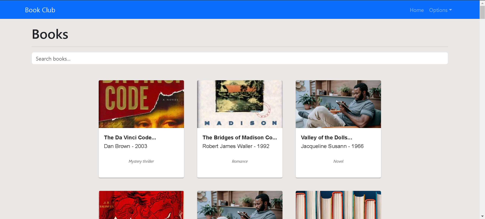

# BookClub

## Table of Contents

- [Introduction](#introduction)
- [Getting Started](#getting-started)
  - [Prerequisites](#prerequisites)
  - [Installation](#installation)
  - [Running Docker](#run-docker)
- [Rest API Documentation](#api-documentation)
- [Usage](#usage)
- [Contributing](#contributing)
- [License](#license)


## Introduction
 The BookClub project is a <a href="https://www.django-rest-framework.org/">Django Rest Framework</a> and <a href="https://react.dev/"> React </a> application comprising of series of endpoints that displays a list of books, create notes and summaries. 

 

Django is a python web framework used in the creation of complex database driven websites. It makes it easy to create secure and maintainable websites using python.
Django is versatile and follows the “Batteries included” principle where almost everything you need can be gotten from Django and you don’t have to build from scratch. It is able to deliver content in almost any format (HTML, RSS, JSON, XML).


React is a popular open-source JavaScript library used for building user interfaces, particularly single-page applications. It allows developers to create reusable UI components that manage their own state, making complex interfaces easier to develop and maintain. React's core concept is the virtual DOM, which improves performance by efficiently updating and rendering components when the underlying data changes. It promotes a component-based architecture, enabling the composition of small, isolated pieces of code to build large applications.


Technologies used

- Backend: Python & Django
- Frontend: JS & React
- REST API documentation: Swagger UI
- Testing: unittest
- CI - Github Actions
- Containerization - Docker


## Getting Started

To run this web application on your local machine, follow the steps below:

### Prerequisites

Before getting started, ensure that you have the following software installed on your machine:

- Python: Download and install Python from the official website: https://www.python.org/downloads/
- GIT: Download and install GIT from the official website: https://git-scm.com/downloads
- Node: Download and install GIT from the official website: https://nodejs.org/en/download/package-manager

### Installation

Step-by-step guide on how to install the project and its dependencies.

1. Clone the repository to your local machine using Git:

```bash
$ git clone https://github.com/bosukeme/BookClub.git
```

2. Set up the backend
<br>

##### 2.1. Navigate to the project directory

```bash
$ cd BookClub/backend
```


##### 2.2. Create and activate a virtual environment

```
# windows
$ python -m venv venv
```

```
# linux, macOs
$ python3 -m venv venv
```

```
# windows
$ venv\Scripts\activate
```
```
# linux, macOs
$ Source venv/bin/activate
```

##### 2.3. Install the project dependencies contained inside the requirements.txt file using pip/pip3:

```bash
(venv)$ pip install -r requirements.txt
```

##### 2.4. Before you start the application, you need to set up an environment variables. Here's how you can do it:

```bash
DEBUG=
SECRET_KEY=
DJANGO_ALLOWED_HOSTS=
```

Create a file called `.env` file at the backend folder of the project with the environmental variables above. Replace "DEBUG","SECRET_KEY", "DJANGO_ALLOWED_HOSTS" with the appropriate values.


##### 2.5 Running the django backend


Once you have installed the dependencies, you can start the web application using

```bash
  (venv)$ python manage.py makemigrations
  (venv)$ python manage.py migrate
  (venv)$ python import_books.py

```
 
```bash
(venv)$ python manage.py runserver
```


##### 2.6 Running Tests

Once you have installed the dependencies, you can run test within the directory

```bash
(venv)$ python manage.py test
```
<br>

3. Set up the frontend

##### 3.1. Open a new terminal and Navigate to the frontend directory

```bash
$ cd BookClub/frontend
```

##### 3.2. Install node dependencies

```bash
$ npm install
```

##### 3.3. start react frontend

```bash
$ npm start
```

### Run docker

navigate to the root directory

```bash
docker-compose up --build
```

To stop the containers

```bash
docker-compose stop
```

## API documentation

Access API documentation via Swagger UI using the link below after starting up the application

```bash
http://127.0.0.1:8000/api/schema/docs/
```

## Usage
- Using the API: Refer to the Swagger API documentation at http://127.0.0.1:8000/api/schema/docs/ for a detailed list of available endpoints and how to interact with them.

- Troubleshooting
  If you encounter any issues or have questions, please feel free to reach out to us by creating an issue on our GitHub repository: https://github.com/bosukeme/BookClub.git


## License

This project is licensed under the MIT License.

## Authors

Contributors names and contact info

Ukeme Wilson
